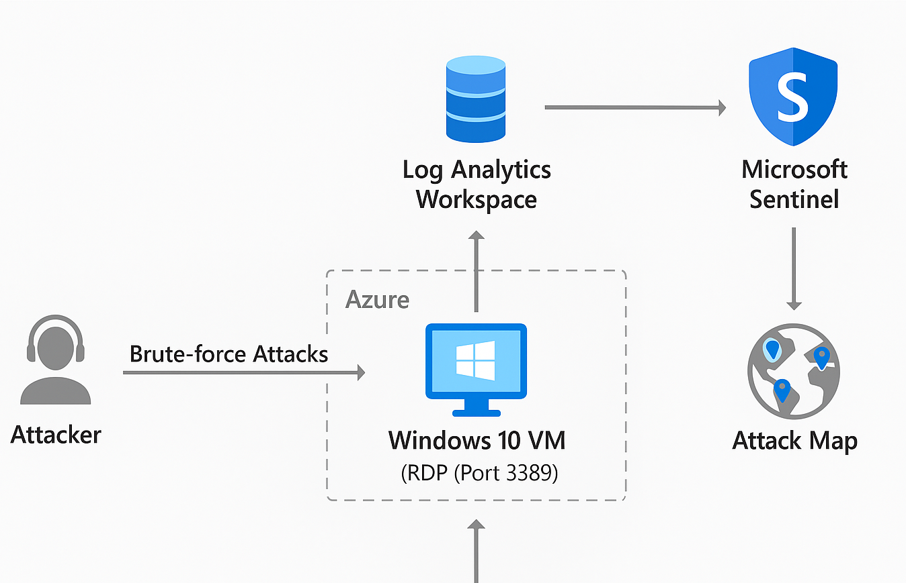

# azure-honeypot-siem
A cybersecurity honeypot project using Azure VM, Microsoft Sentinel, and KQL to monitor and visualize brute-force RDP attacks.

# Azure Honeypot SIEM Project

This project simulates real-world brute-force attacks using a Windows 10 virtual machine on Microsoft Azure, integrated with Microsoft Sentinel. I created an intentionally insecure virtual machine with the intentions of it serving as a honeypot. With this project, I was able to demonstrate core skills in security event logging, log analysis, KQL, and SIEM dashboards. 

## 🛠️ Tools & Technologies
- **Azure Virtual Machine** (Windows 10)
- **Microsoft Sentinel** (SIEM)
- **Log Analytics Workspace**
- **Kusto Query Language (KQL)**
- **Event Viewer**
- **Sentinel Workbooks**
- **Watchlists (IP Geolocation)**

---

## 📌 Project Architecture
 



- This diagram represents the basic honeypot setup within Azure. 
---

## 📖 Project Overview

### 1. 🧱 VM Setup & Exposure
- Deployed a Windows 10 VM in Azure
- Opened inbound RDP (port 3389) in NSG to attract attackers
- Disabled Windows Firewall to simulate poor security

### 2. 📊 Logging Attacks
- Logged failed login attempts (Event ID 4625) in Event Viewer
- Forwarded logs to Log Analytics via Microsoft Sentinel

### 3. 🔍 KQL Analysis

This kql command was utilizied to brute force attacks from a specific user. I utilized event ID 4625 in my code since it represents failed login attempts. The count function was utilizied alongside the query filtering to group specific locations by the number of times they attempted to brute force the login. 

```kql
SecurityEvent
| where EventID == 4625
| summarize count() by IpAddress, Account, TimeGenerated
| sort by count_ desc
```
### 4. 🌍 Geo-IP Enrichment
Imported geoip-summarized.csv as a Sentinel Watchlist

Used ipv4_lookup() to map IP addresses to geolocations

🌐 IP Geolocation & Enrichment with Watchlist
To gain geographic insight into brute-force login attempts, I enriched the raw IP data from security logs using a custom Sentinel Watchlist. The watchlist was built from a CSV (geoip-summarized.csv) containing geolocation data mapped to IP ranges.

This allowed me to match attacker IP addresses to countries and regions, and was a critical step in producing the global attack map.

```kql
let GeoIPDB_FULL = _GetWatchlist("geoip");
let WindowsEvents = SecurityEvent
    | where IpAddress == <attacker IP address>
    | where EventID == 4625
    | order by TimeGenerated desc
    | evaluate ipv4_lookup(GeoIPDB_FULL, IpAddress, network);
WindowsEvents
```

### 5. 🗺️ Attack Map Visualization
Created a Sentinel Workbook with a world map showing attack origins

JSON-based query to visualize data by IP country

## 🎯 Learning Outcomes
Through this project, I developed and applied a range of technical and analytical skills critical to cybersecurity operations:

🔧 Cloud Infrastructure (Azure):
Deployed and managed a Windows VM in Microsoft Azure. Configured Network Security Groups (NSGs) and practiced responsible cloud cost management.

🛡️ Security Operations Fundamentals:
Simulated real-world brute-force attacks by exposing RDP. Observed attacker behavior and system responses to enhance SOC readiness.

🔍 SIEM & Log Analysis (Microsoft Sentinel):
Integrated the VM with Microsoft Sentinel and Log Analytics Workspace. Used Kusto Query Language (KQL) to analyze Windows security logs and identify Event ID 4625 (failed login attempts).

🚨 Threat Detection & Response:
Performed simulated attacks and observed real-time attacker attempts. Interpreted logs to detect unauthorized access and malicious behavior.

🌍 Log Enrichment (GeoIP):
Imported a 54,000-row GeoIP CSV file as a Sentinel Watchlist. Enriched logs with attacker geolocation data to improve threat context.

📊 Data Visualization:
Created a Sentinel Workbook and visual attack map showing the geographic origin of brute-force attempts. Practiced transforming raw log data into visual, executive-friendly formats.

🔐 Security Misconfiguration Awareness:
Observed how firewall misconfigurations (e.g., exposed port 3389) can lead to rapid attack attempts, reinforcing principles of attack surface reduction.

📁 Project Documentation & GitHub Presentation:
Structured and documented a complete honeypot project on GitHub. Learned best practices for presenting technical projects and security research.

